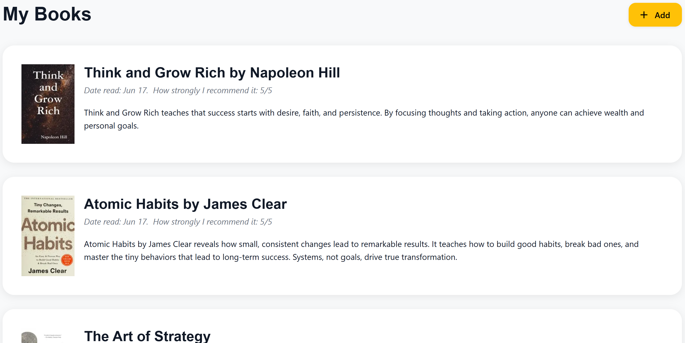
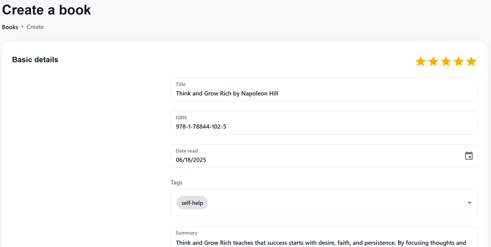
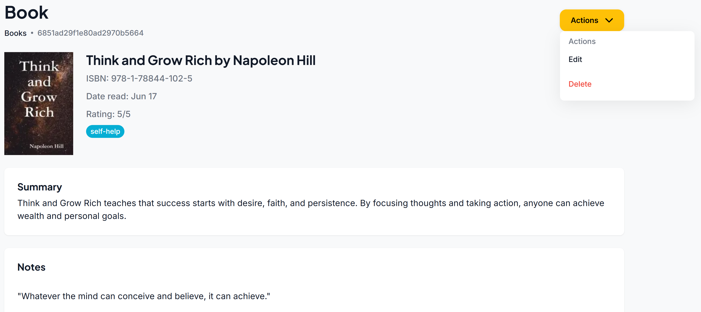
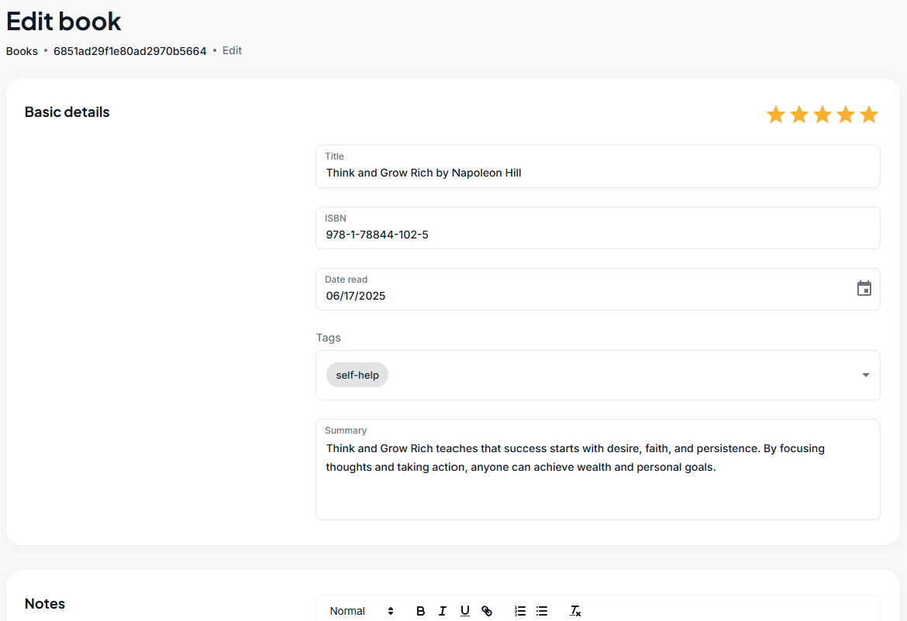
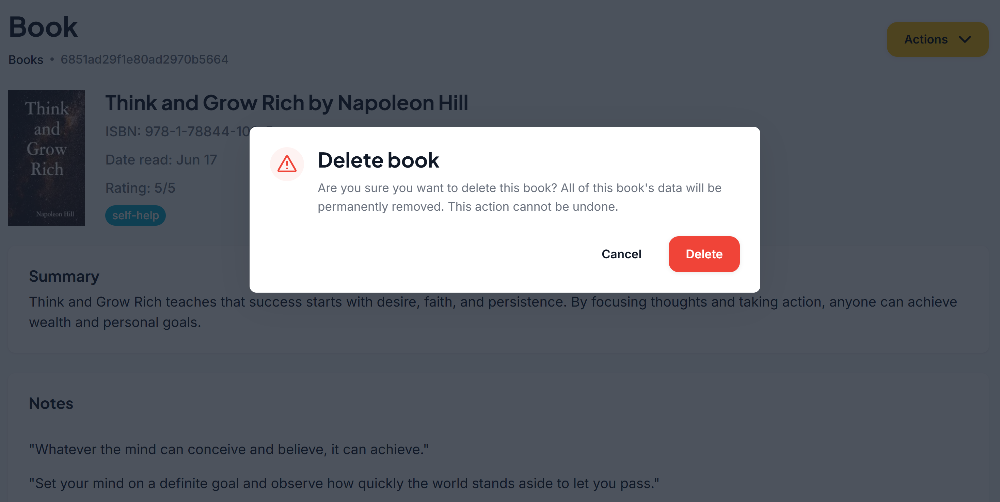
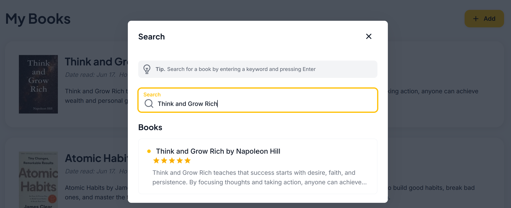

# Book Notes App (MERN Stack)

Welcome to the **Book Notes App**!  
This project allows users to track notes about the books they've read, including summaries, ratings, and reading dates.  
The project is built using the **MERN stack**: **MongoDB, Express, React.js/Next.js, and Node.js**, and is divided into two main components:

- [`books-api`](./books-api) — The backend API (Node.js + Express)
- [`books-app`](./books-app) — The frontend application (Next.js)

## 📚 Project Structure

```bash
.
├── books-api/      # Node.js API with CRUD operations for books
└── books-app/      # Next.js frontend application
````

## 🛠 Tech Stack

- **Backend**: Node.js, Express.js, MongoDB (Mongoose)
- **Frontend**: React.js (with Next.js)
- **Other**: TypeScript, Material UI, REST APIs

## ✨ Features

- **Create** new book notes
- **Read** details of a single book or all books for a user
- **Update** existing book notes
- **Delete** a book note
- **Search** for a book
- **User association** with each book

## 📦`books-api` — Backend Overview

The `books-api` contains:

- **Models**: Mongoose schemas for books and users
- **Controllers**: Express route handlers
- **Services**: Business logic for interacting with the database
- **Routes**: API endpoints

## User Model

```typescript

const UserSchema: Schema = new Schema(
  {
    email: { type: String, required: true, unique: true },
    emailConfirmed: { type: Boolean, default: false },
    firebaseUid: { type: String, unique: true, sparse: true }, // For Firebase authentication
    name: { type: String, required: true },
    password: {
      type: String,
      required: function () {
        return authConfig.strategy === Issuer.Jwt; // Password is required only for JWT strategy
      },
    },
  },
  { timestamps: true }
);

````

## Book Model

```typescript

const BookSchema: Schema = new mongoose.Schema(
  {
    isbn: { type: String, required: true },
    notes: {
      html: { type: String, default: null },
      plain: { type: String, default: null },
    },
    rating: { type: Number, min: 0, max: 5, default: null },
    readDate: { type: Date, default: null },
    summary: { type: String },
    tags: [
      {
        type: mongoose.Schema.Types.ObjectId,
        ref: "Tag",
      },
    ],
    title: { type: String, required: true },
    userId: {
      type: mongoose.Schema.Types.ObjectId,
      ref: "User",
      required: true,
    },
  },
  { timestamps: true }
);

````

## Tag Model

```typescript

const TagSchema: Schema = new mongoose.Schema(
  {
    name: { type: String, required: true, unique: true },
    slug: { type: String, required: true, unique: true },
  },
  { timestamps: true }
);

````

## API Endpoints

| Method | Endpoint                | Description             |
|--------|-------------------------|-------------------------|
| POST   | `/api/auth/signin`      | Sign in a user          |
| POST   | `/api/auth/signup`      | Sign up a user          |
| POST   | `/api/books`           | Create a new book        |
| GET    | `/api/books/:id`       | Get a single book by ID  |
| GET    | `/api/books?userId=...`| Get all books for a user |
| PUT    | `/api/books/:id`       | Update a book by ID      |
| DELETE | `/api/books/:id`       | Delete a book by ID      |

## 🎨 `books-app` — Frontend Overview
The `books-app` allows the client to:
- View, create, update, and delete book entries
- Rate and summarize books
- Responsive UI with Material Design

## 🖼️ Screenshots

Take a look at how the Book Notes app works:

**- View the list of books**



**- Create a book**



**- View a book**



**- Edit a book**



**- Delete a book**



**- Search for a book**



## 🧪Getting Started

### 1. Clone the repo

```bash

git clone https://github.com/abujanda/books.git
cd books
````
### 2. Install dependencies for both projects

```bash
cd books-api
npm install
cd ../books-app
npm install
````

### 3. Set up environment variables
Each project has its own `.env.example` file. Rename to .env and fill in appropriate values.

### 4. Run the projects
Start the backend:

```bash
cd books-api
npm run dev
````
Start the frontend:
```bash
cd ../books-app
npm run dev
````
## (NEW) v2.0 - June 18, 2025
- ✅ User authentication and protected routes (Firebase & JWT)
- ✅ Tagging or categorizing books
- ✅ Search and filter capabilities
- ✅ Rich text notes support
  
## 📌 Future Enhancements
- AI-powered note summarizer
- Sentiment analysis of notes
- Reading streaks or habit tracker
- Personal reading stats dashboard
- Caching
